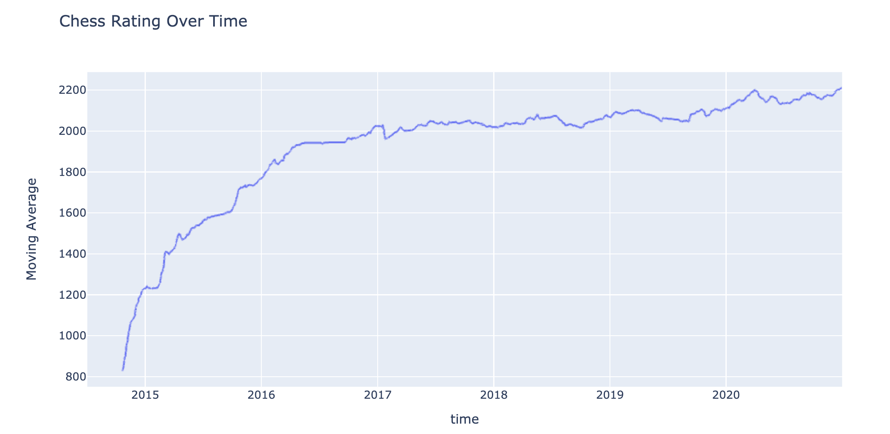

# chess_history

A simple notebook to get a rating history graph across all your chess(dot)com usernames.  Set the start and end years, the usernames, and the number of games to apply a moving average to. Call `get_games()` to get your games and `create_game_plot()` to plot the rating. 

### Sample Graph:

